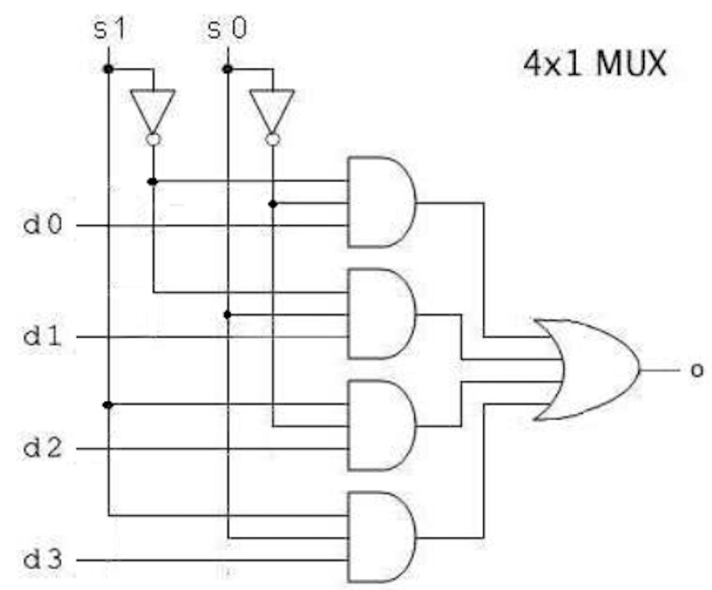

## Introduction

The programming assignments are for Computer Systems Structure CSC205 course. These are all verilog (gate level) programs. 

1. AddSub.v: Takes input X and Y from the user, ranging between 00-15. It add or subtract the two numbers depending upon user requirements. The output is provided in both binary and decimal number system. 

2. Decoder2x4: 2X4 decoder has s1 ans s2 as 2 inputs, and o0, o1, o2, o3 as 4 outputs. Design is tested using s1 and s0 set to 00, 01, 10 and 11. Decoder output 1000, 0100, 0010, 0001 is produced respectively.

3. Majority.v: A Full Adder can be composed by a parity function (Sum) and a Majority function (Carry-out). This program is used to design a Majority function. A, B, and C are 3 inputs. and F is the majority function output. The design is tested using various test cases for A, B and C.

4. Mux4X1: 4x1 mux has 4 inputs - d0 to d3, 2 select lines s0 and s1 and 1 output O. The select lines s0 and s1 select one of the four input lines to connect the output line. The particular input combination on select lines selects one of input (D0 through D3) to the output.

